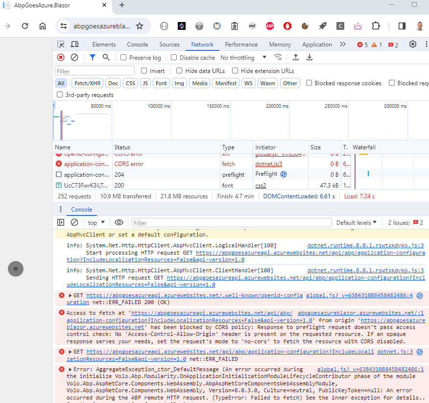
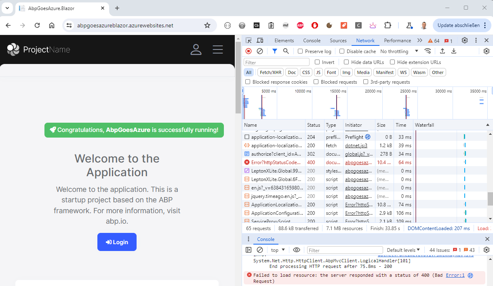
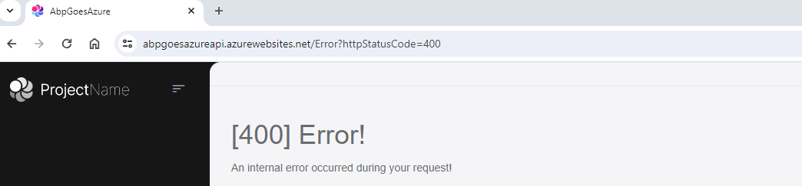
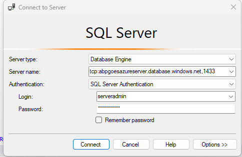
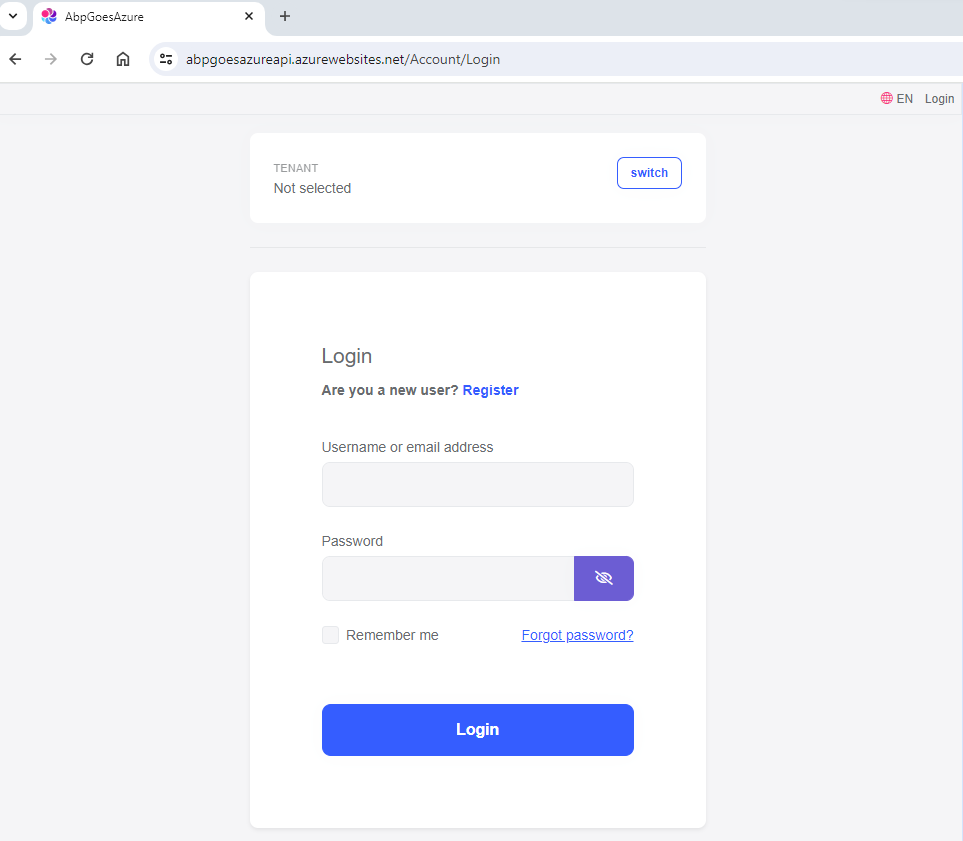

## Blazor Deployment succeeded. Web App still not working. Fix the issues

* When the Release pipeline has finished and the BlazorDeployment succeeded, open a browser window and navigate to the URL of your Blazor Web App

```html
    https://[YourAppName]blazor.azurewebsites.net
```

* You will probably see the error below



### Solve the CORS error

* Go to the appsettings.Staging.json** file [YourAppName].HttpApi.Host project on your computer.
* Replace the **localhost urls** for **CorsOrigins** and **RedirectAllowedUrls**

```bash
{
  "App": {
    "SelfUrl": "https://[YourAppName]api.azurewebsites.net",
    "CorsOrigins": "https://[YourAppName]blazor.azurewebsites.net",
    "RedirectAllowedUrls": "https://[YourAppName]blazor.azurewebsites.net"
  },
  "ConnectionStrings": {
    
    "Default": "Server=tcp:abpgoesazureserver.database.windows.net,1433;Initial Catalog=AbpGoesAzureDb;Persist Security Info=False;User ID=serveradmin;Password=Server2008!;MultipleActiveResultSets=False;Encrypt=True;TrustServerCertificate=False;Connection Timeout=30;"
  },
  "AuthServer": {
    "Authority": "https://[YourAppName]api.azurewebsites.net",
    "RequireHttpsMetadata": false,
    "SwaggerClientId": "AbpGoesAzure_Swagger"
  },
  "StringEncryption": {
    "DefaultPassPhrase": "5jDFap2Dk454yHA0"
  },
  "OpenIddictCertificate": { 
      "X590": 
        { 
          "PassWord": "This_Password_Will_Be_Set_In_The_Release_Pipeline" 
        }  
    }
}
```

* Push your changes to GitHub.

```bash
    git add .
    git commit -m AppsettingsStagingChanged
    git push
```

* A new **Build** gets triggered and after a new **Release** will start.
* Wait until the Release has finished and the Deployment Succeeded.
* Navigate to https://[YourAppName]blazor.azurewebsites.net



* Try to login by clicking the Login button in the ABP Framework Blazor website



### Solve An internal error occurred during your request

* Open SQL Management Studio and make a connection with your SQL Server in Azure.



* Go to the **dbo.OpenIddictApplications** table in [YourAppName]Db database.
* Run the SQL statement below to clear its content.

```bash
    DELETE FROM [dbo].[OpenIddictApplications]
```

* Go to the **appsettings.json** file in the [YourAppName].DbMigrator project on your computer
* Replace the localhost RootUrl settings  

```bash
{
  "ConnectionStrings": {
    "Default": "Server=tcp:abpgoesazureserver.database.windows.net,1433;Initial Catalog=AbpGoesAzureDb;Persist Security Info=False;User ID=serveradmin;Password=Server2008!;MultipleActiveResultSets=False;Encrypt=True;TrustServerCertificate=False;Connection Timeout=30;"
  },
  "OpenIddict": {
    "Applications": {
      "AbpGoesAzure_Blazor": {
        "ClientId": "AbpGoesAzure_Blazor",
        "RootUrl": "https://[YourAppName]blazor.azurewebsites.net"
      },
      "AbpGoesAzure_Swagger": {
        "ClientId": "AbpGoesAzure_Swagger",
        "RootUrl": "https://[YourAppName]api.azurewebsites.net"
      }
    }
  }
}
```

* Open a command prompt in the [YourAppName].DbMigrator project and apply the database migrations.

```bash
    dotnet run
```

* Navigate to https://[YourAppName]blazor.azurewebsites.net and try to login again.
* You should get navigated to the ABP login page.




* Click the **Edit** button
* Click on the **Variables** tab on the top of the page
* Click on the **+ Add link** to add a new entry

[[Home]](../README.md) - [[Previous]](tutorial/../9.add-an-extra-stage-in-the-release-pipeline-for-the-blazor-project.md)