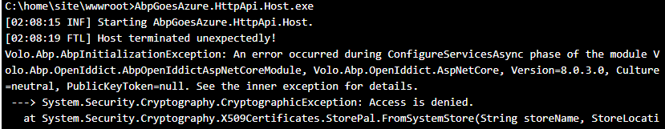
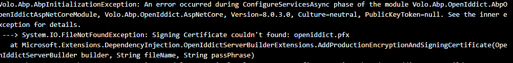

## API Deployment succeeded. Web App not working. Fix the issues

* Open the **CMD Debug Console** in the **Kudu** window by navigating to **[YourAppName]api.scm.azurewebsites.net**

* Navigate to the wwwroot to see f [YourAppName].HttpApi.Host files have been deployed.

```bash
    cd site/wwwroot
```

* Check the dotnet version of the Azure Web App. Should be 8.0.x.

```bash
   dotnet --version
```


### HTTP Error 500.30 - - ASP.NET Core app failed to start

Run the command below in the **Kudu Console** to get the **error information** needed.

```bash
   [YourAppName].HttpApi.Host.exe
```



### Solve CryptographicException

* Go to the **[YourAppName].HttpApi.Host** project.
* Copy/paste **appsettings.json** file and rename to **appsettings.Staging.json**.
* Set SelfUrl and Authority to https://[YourAppName]api.azurewebsites.net.
* Don't forget to set your serveradmin password.

```bash
{
    "App": {
      "SelfUrl": "https://[YourAppName]api.azurewebsites.net",
      "CorsOrigins": "https://*.Abp2Azure.com,https://localhost:44326",
      "RedirectAllowedUrls": "https://localhost:44326"
    },
    "ConnectionStrings": {
      "Default": "Server=tcp:abp2azureserver.database.windows.net,1433;Initial Catalog=[YourAppName]Db;Persist Security Info=False;User ID=serveradmin;Password={your_password};MultipleActiveResultSets=False;Encrypt=True;TrustServerCertificate=False;Connection Timeout=30;"
    },
    "AuthServer": {
      "Authority": "https://[YourAppName]api.azurewebsites.net",
      "RequireHttpsMetadata": false,
      "SwaggerClientId": "Abp2Azure_Swagger"
    },
    "StringEncryption": {
      "DefaultPassPhrase": "rzFy34GkL3lA6vx0"
    },
    "OpenIddictCertificate": { 
        "X590": 
          { 
            "PassWord": "This_Password_Will_Be_Set_In_The_Release_Pipeline" 
          }  
      }
  }

```

* In the **[YourAppName]HttpApiHostModule** of the **[YourAppName].HttpApi.Host** project add the code below

```csharp
    // using Volo.Abp.OpenIddict;

    PreConfigure<OpenIddictBuilder>(builder =>
    {
        builder.AddValidation(options =>
        {
            options.AddAudiences("Abp2Azure");
            options.UseLocalServer();
            options.UseAspNetCore();
        });

        var hostingEnvironment = context.Services.GetHostingEnvironment();
        var configuration = context.Services.GetConfiguration();

        if (hostingEnvironment.IsDevelopment()) return;

        PreConfigure<AbpOpenIddictAspNetCoreOptions>(options =>
        {
            options.AddDevelopmentEncryptionAndSigningCertificate = false;
        });

        PreConfigure<OpenIddictServerBuilder>(serverBuilder =>
        {
            serverBuilder.AddProductionEncryptionAndSigningCertificate("openiddict.pfx", configuration["OpenIddictCertificate:X590:Password"]);
        });
    });

```

### Generate the openiddict.pfx certificate

* Open a command prompt in the root of the **HttpApi.Host** project and run the following command

```bash
    dotnet dev-certs https -v -ep openiddict.pfx -p f97f0fb2-6263-4464-945c-a636cc6b1cb3
```

### Add openiddict.pfx certificate to Azure App Service

* Go to your **[YourAppName]API** WebApp in the Azure Portal.
* Click on the **Certificates** tab in the left menu.
* Click on the **Bring your own certificates (.pfx)** tab in the top menu.
* Click on **+Add certificate**.
* Select **Upload certificate (-pfx)**  In **the Add private key certificate** window.
* Upload the **openiddict.pfx** certificate you just generated.
* Enter the **Certificate password**, in this case: f97f0fb2-6263-4464-945c-a636cc6b1cb3
* Enter a **Certificate friendly name**: OpenIddictCertificate.
* Click **Validate** and then **Add**.

[!Add private key certificate](../images/add_private_key_certificate.png)

### Set Certificate password by the Pipeline

* Open AzureDevops, Go to the Releases pipelines and click Edit.
* Click on the **View stage tasks** link in the **[YourAppName]Api** Stage.
* Open the **Deploy Azure App Service** task.
* Open the **File Transforms & Variable Substitution Options** section.
* Enter the value below in the **JSON variable substitution** input field.

```bash
    **/appsettings.Staging.json
```

* Click on the **Variables** tab in the top menu.
* Enter **OpenIddictCertificate.X590.PassWord** in the Name input field.
* Enter the **Certificate password** in the Value input field.
* Click save.
  
  [!Variable substitution in release pipeline](../images/variable_substitution_in_release_pipeline.png)

* Go back to your project on your computer and push your changes to GitHub.

```bash
    git add .
    git commit -m OpenIddictCertificateAdded
    git push
```

A new **Build** gets triggered as **Continuous Integration** is enabled.
After the **Build** has finished, a new **Release** will start.
Wait until the Release has finished and the Deployment Succeeded

### **[YourAppName]api.azurewebsites.net** still Error 500.30

* Open the **CMD Debug Console** in the **Kudu** window by navigating to **[YourAppName]api.scm.azurewebsites.net**

* Run the command below in the **Kudu Console** to get the **error information** needed.

```bash
   [YourAppName].HttpApi.Host.exe
```



* Add an exception to your .gitignore file to get your openiddict.pfx file uploaded.

```bash
    !openiddict.pfx
```

* Open the [YourAppName].HttpApi.Host.csproj file and add this piece of code.

```bash
    <ItemGroup>
        <Content Include="openiddict.pfx">
            <CopyToOutputDirectory>PreserveNewest</CopyToOutputDirectory>
        </Content>
    </ItemGroup>
```

* Push your changes to your GitHub repository.

```bash
    git add .
    git commit -m OpenIddictFileAdded
    git push
```

A new **Build** gets triggered as **Continuous Integration** is enabled.
After the **Build** has finished, a new **Release** will start.
Wait until the Release has finished and the Deployment Succeeded.

### API Up and Running


[[Previous]](tutorial/../6.create-a-release-pipeline-and-deploy-httpapi-host-project.md) - [[Next]](tutorial/../8.create-a-web-app-in-the-azure-portal-for-the-blazor-project.md)
